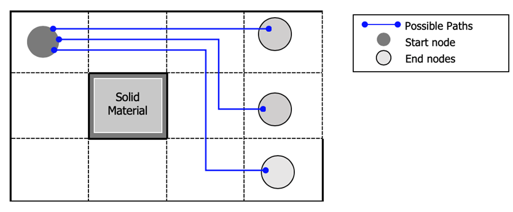

# TauGeometric  🐍

TauGeometric is a set of tools to get the geometric tortuosity from 2D images of porous materials. It calculates the geometric tortuosity using A* algorithm and [Porespy](http://porespy.org/) python library resources. The basis of the computation is to extract all the paths of the porous media generated by porespy and after that, extract the distance of these using A* algorithm. The minimum of these values are taken for every entrance node where the paths starts. At the end, the tortuosity is calculated following the equation (1).


-----
### Equation (1)


<div style="text-align:center"></div>


**Where**:

**Ld** is the mean of the paths's lenght calculated previously 

**L** is the lenght of the axis taken, commonly the horizontal axis.


The fundamental equation of the process explained in the algorithm can resumed in the equation (2).


### Equation (2)

<div style="text-align:center"> </div>


**Where:**

` i`: is the quatity of entrance nodes

` Ci`: represents all the paths generated for every entrance node

` L`: shorter length (it can be a straight line)

# Geometric Paths



To find the total geometric paths the carnality of each set is multiplied.

**S**=set of start nodes

**E**= set of end nodes 

Total geometric paths=**N(S)×N(E)**


# Installation 

TauGeometric relies heavily on the Scipy Stack, as it uses the Porespy library. Make sure you get Python 3.6+ version.

Once you've installed Conda, you can then install TauGeometric. It is available on the Python Package Index 
and can be installed by typing the following at the conda prompt:

    pip install taugeometric
or 

    git clone https://github.com/eljosephavila123/taugeomectic.git 

Create the virtual environment[]

    virtualenv env

The virtual environment is activated

    source env/bin/activate

Install the python library used in the module

    pip install -r requirements.txt
    

On Mac or Linux, you need to open a normal terminal window,
then type source activate {env} where you replace {env} with the name 
of the environment you want to install TauGeometric.

# Examples

``` python
import taugeometric as tg
import porespy as ps
import numpy as np
import matplotlib.pyplot as plt

im = ps.generators.blobs(shape=[30, 30], porosity=0.80, blobiness=0.5)
maze = np.logical_not(im)
maze = np.array(maze, dtype=int)
plt.imshow(im)
print(tg.tortuosity.tortuosity_geometric_2d(maze))
```


